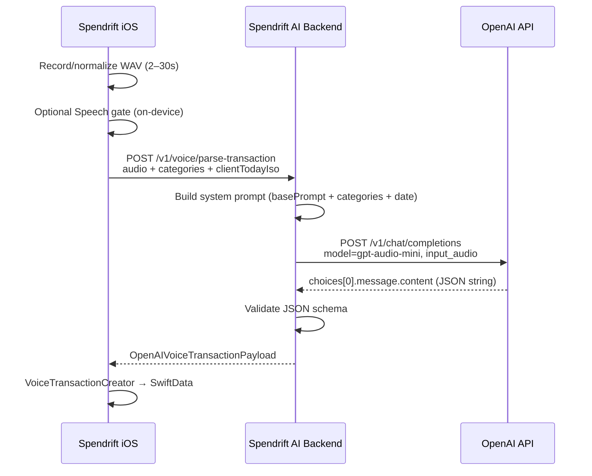
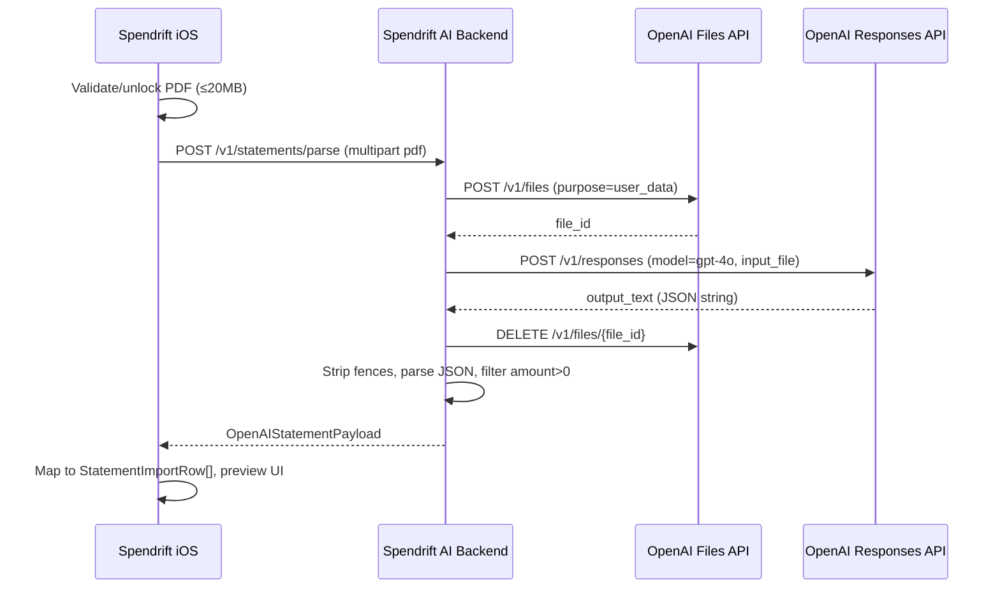

# Spendrift AI Backend Proxy — Implementation Spec

> **Audience:** Backend agent / engineer building a JavaScript (Node.js) service that replaces direct OpenAI calls from the Spendrift iOS app.
>
> **Goal:** Move all third-party AI API traffic off the device so model names, prompts, and provider API keys can be changed server-side without an App Store release.
>
> **Scope of this document:** API routes, request/response JSON contracts, prompt assembly, upstream model calls, error handling, and operational notes. **No iOS code changes are included here** — this is the target contract the mobile client should eventually call.

---

## Table of contents

1. [Executive summary](#1-executive-summary)
2. [What stays on iOS vs what moves to the backend](#2-what-stays-on-ios-vs-what-moves-to-the-backend)
3. [Recommended backend stack & layout](#3-recommended-backend-stack--layout)
4. [Authentication & security](#4-authentication--security)
5. [Global conventions](#5-global-conventions)
6. [Endpoint: Parse voice transaction](#6-endpoint-parse-voice-transaction)
7. [Endpoint: Parse bank statement PDF](#7-endpoint-parse-bank-statement-pdf)
8. [Endpoint: Health check (recommended)](#8-endpoint-health-check-recommended)
9. [Environment variables & model configuration](#9-environment-variables--model-configuration)
10. [Error mapping reference](#10-error-mapping-reference)
11. [iOS client integration checklist (future)](#11-ios-client-integration-checklist-future)
12. [Testing guidance](#12-testing-guidance)
13. [Appendix A — Full voice system prompt (`basePrompt.md`)](#appendix-a--full-voice-system-prompt-basepromptmd)
14. [Appendix B — Current iOS source map](#appendix-b--current-ios-source-map)

---

## 1. Executive summary

The Spendrift iOS app currently makes **two** distinct AI calls, both directly to OpenAI using an API key embedded in the app bundle (`AppSecrets.openAIAPIKey` → `Info.plist` key `OpenAIApiKey`):

| Feature | iOS service | Upstream OpenAI API | Current model |
|---------|-------------|---------------------|---------------|
| Voice expense capture | `OpenAIVoiceTransactionService` | `POST /v1/chat/completions` (audio input) | `gpt-audio-mini` |
| Bank statement import | `OpenAIBankStatementService` | `POST /v1/files` → `POST /v1/responses` → `DELETE /v1/files/{id}` | `gpt-4o` |

The backend proxy exposes **two application routes** that mirror these features. Each route:

1. Accepts the same semantic inputs the iOS app already has locally (audio + categories, or PDF bytes).
2. Assembles the same prompts the iOS app assembles today.
3. Calls the configured upstream provider/model.
4. Returns JSON in the **exact shapes** the iOS app already decodes (`OpenAIVoiceTransactionPayload`, `OpenAIStatementPayload`).

The iOS app performs **post-AI business logic locally** (account selection, category matching, SwiftData inserts, speech-presence gating). The backend must **not** duplicate that logic unless you intentionally expand scope later.

---

## 2. What stays on iOS vs what moves to the backend

### Moves to backend (this spec)

- OpenAI API key storage and rotation
- Model selection (`gpt-audio-mini`, `gpt-4o`, or future replacements)
- Prompt construction (system prompt + dynamic category blocks + date context)
- Audio → Chat Completions request body
- PDF upload → Responses API flow (Files API upload, inference, file deletion)
- Upstream error handling and response text extraction
- Optional: rate limiting, logging, cost tracking, provider failover

### Stays on iOS (do not reimplement in v1)

| Concern | iOS location | Notes |
|---------|--------------|-------|
| Recording & WAV normalization | `SpeechTranscriptionService`, `VoiceShortcutAudioNormalizer` | Client sends **WAV** (44.1 kHz, mono, 16-bit PCM). Backend accepts as-is. |
| Min/max clip duration (2s–30s) | `VoiceAudioPolicy` | Enforced client-side before network call. |
| On-device speech gate | `VoiceRecordingSpeechPresence` | Uses Apple Speech framework to skip silent clips **before** calling AI. Backend may still receive error JSON from the model for edge cases. |
| Transaction creation | `VoiceTransactionCreator` | Maps AI JSON → `Transaction` in SwiftData; resolves primary account; case-insensitive category match. |
| PDF size / encryption UX | `StatementImportView` | Max 20 MB; password unlock handled locally before upload. |
| Markdown fence stripping (statements) | `OpenAIBankStatementService.stripMarkdownCodeFence` | **Recommend doing this on the backend** so iOS stays thin; iOS already handles it if model disobeys. |
| Date parsing for statement rows | `OpenAIBankStatementService.parseDate` | iOS maps ISO strings → `Date` after receiving payload. Backend should prefer ISO 8601 dates in responses. |

---

## 3. Recommended backend stack & layout

This spec is provider-agnostic at the HTTP boundary but documents the **current OpenAI-compatible** upstream calls verbatim from iOS.

Suggested Node.js layout:

```
spendrift-ai-backend/
├── src/
│   ├── index.ts                 # Express/Fastify bootstrap
│   ├── config/
│   │   └── env.ts               # Zod-validated env (models, keys, base URL)
│   ├── middleware/
│   │   ├── auth.ts              # Bearer or device token
│   │   └── errorHandler.ts
│   ├── routes/
│   │   ├── health.ts
│   │   ├── voice.ts             # POST /v1/voice/parse-transaction
│   │   └── statements.ts        # POST /v1/statements/parse
│   ├── services/
│   │   ├── openaiClient.ts      # chat/completions, files, responses
│   │   ├── voicePrompt.ts       # basePrompt + dynamic blocks
│   │   └── statementPrompt.ts
│   └── types/
│       ├── voice.ts
│       └── statement.ts
├── prompts/
│   └── basePrompt.md            # Copy from iOS Spendrift/basePrompt.md
├── package.json
└── .env.example
```

Use **TypeScript** with strict JSON schema validation (e.g. Zod) at route boundaries so the mobile contract stays stable.

---

## 4. Authentication & security

The iOS app currently has **no backend auth** (it sends the OpenAI key from the bundle). When introducing a proxy, add authentication before production.

### Recommended v1 auth

```
Authorization: Bearer <SPENDRIFT_CLIENT_TOKEN>
```

- Issue a long-lived app token baked into the iOS binary **or** fetched after App Store receipt validation (future).
- Rotate tokens server-side without App Store updates by maintaining an allowlist / JWT issuer.

### Transport

- HTTPS only (TLS 1.2+).
- Do not log raw audio or PDF bytes.
- Delete uploaded PDFs from the provider immediately after inference (iOS already does this via `defer { deleteFile }`).

### Privacy

Both features send **user financial data** off-device today. The backend privacy posture should match the in-app copy in `StatementImportView` and onboarding: data is processed by a third-party AI provider to suggest transactions.

---

## 5. Global conventions

### Base URL

```
https://api.spendrift.example.com
```

All routes below are relative to this base.

### Content types

| Route | Request | Success response |
|-------|---------|------------------|
| Voice parse | `multipart/form-data` **or** `application/json` | `application/json` |
| Statement parse | `multipart/form-data` | `application/json` |

Prefer **multipart** for binary payloads (audio, PDF). JSON-with-base64 is acceptable for voice if easier for the iOS client.

### Standard error envelope (backend-level)

When the **backend** fails (not the AI model returning a business-logic error JSON), respond with:

```json
{
  "error": {
    "code": "upstream_failed",
    "message": "Human-readable summary",
    "details": "Optional raw upstream body or internal reason"
  }
}
```

HTTP status codes:

| Status | Meaning |
|--------|---------|
| `200` | Success — body is feature-specific success JSON |
| `400` | Invalid request (missing audio, bad category list, PDF too large) |
| `401` | Missing/invalid auth |
| `413` | Payload too large |
| `502` | Upstream AI provider error |
| `504` | Upstream timeout |

**Important:** Voice parsing business failures (`status: "error"` in the AI payload) are **`200 OK`** with the error JSON shape — the iOS client treats that as a successful HTTP call and branches on `payload.status`.

### Idempotency

Neither endpoint needs idempotency keys for v1. Voice and statement parsing are read-only with respect to user data on the server.

---

## 6. Endpoint: Parse voice transaction

### Route

```
POST /v1/voice/parse-transaction
```

### Purpose

Convert a short spoken expense/income description (WAV audio) into a structured transaction JSON object.

**iOS equivalent:** `OpenAIVoiceTransactionService.parseTransaction(audioData:categories:)`

---

### Request

#### Option A — `multipart/form-data` (recommended)

| Field | Type | Required | Description |
|-------|------|----------|-------------|
| `audio` | file | yes | WAV audio file |
| `categories` | string (JSON) | yes | JSON array of category objects (see below) |
| `clientTodayIso` | string | no | ISO-like datetime string from device; if omitted, server uses UTC |
| `timezone` | string | no | IANA timezone, e.g. `Asia/Kolkata`; used when building `clientTodayIso` fallback |

**`categories` JSON shape:**

```json
[
  { "name": "Food", "type": "expense" },
  { "name": "Salary", "type": "income" }
]
```

- `type` must be `"expense"` or `"income"` (matches iOS `TransactionType`).
- Names are matched case-insensitively on iOS after parsing; send exact user category names.

#### Option B — `application/json`

```json
{
  "audioBase64": "<base64-encoded WAV bytes>",
  "audioFormat": "wav",
  "categories": [
    { "name": "Food", "type": "expense" },
    { "name": "Salary", "type": "income" }
  ],
  "clientTodayIso": "2026-06-04T14:30:00",
  "timezone": "Asia/Kolkata"
}
```

| Field | Type | Required | Notes |
|-------|------|----------|-------|
| `audioBase64` | string | yes | Standard base64, no data-URI prefix |
| `audioFormat` | string | yes | Must be `"wav"` (iOS always sends WAV) |
| `categories` | array | yes | See above |
| `clientTodayIso` | string | no | See [Date context](#date-context-for-voice) |
| `timezone` | string | no | IANA identifier |

#### Audio constraints (validated client-side today; backend should defensively check)

| Constraint | Value | iOS source |
|------------|-------|------------|
| Format | WAV (linear PCM) | `OpenAIVoiceTransactionService` → `audioFormat: "wav"` |
| Sample rate | 44100 Hz | `SpeechTranscriptionService`, `VoiceShortcutAudioNormalizer` |
| Channels | 1 (mono) | same |
| Bit depth | 16-bit signed integer LE | same |
| Min duration | 2 seconds | `VoiceAudioPolicy.minClipDurationSeconds` |
| Max duration | 30 seconds | `VoiceAudioPolicy.maxClipDurationSeconds` |

Backend validation (recommended):

- Reject non-WAV or empty audio → `400`.
- Optional: reject clips > ~30s or > ~2.6 MB (rough upper bound for 30s mono 16-bit 44.1kHz WAV).

---

### Prompt assembly (server responsibility)

The iOS app builds the system prompt in `OpenAIVoiceTransactionService.buildPrompt(categories:)`. Replicate this **exactly**:

1. Load static prompt from `basePrompt.md` (see [Appendix A](#appendix-a--full-voice-system-prompt-basepromptmd)).
2. Replace placeholder `{{TODAY_ISO}}` in the static prompt **and** in examples with the runtime date string.
3. Append runtime date block.
4. Append dynamic allowed-categories block.

#### Date context for voice

iOS uses device-local timezone:

```swift
formatter.timeZone = TimeZone.current
formatter.dateFormat = "yyyy-MM-dd'T'HH:mm:ss"
```

**Recommendation:** Accept `clientTodayIso` from the client to preserve “today/yesterday” behavior in the user’s timezone. If missing, compute in `timezone` or UTC and document the fallback.

**Runtime date block** (insert after base prompt):

```markdown
## CURRENT DATE CONTEXT
- Today is {TODAY_ISO}. If the user does not mention a date explicitly, use this exact value.
```

**Dynamic category block** (income names sorted A→Z, expense names sorted A→Z):

```markdown
---

## ALLOWED CATEGORIES (DYNAMIC - CURRENT USER DATA)

### Income
- {name}
- ...

### Expense
- {name}
- ...

---

IMPORTANT:
- Choose category only from the dynamic list above.
- If no match exists in dynamic categories, use null.
```

#### User message (fixed string from iOS)

```
Listen to this recording. If there is no clear spoken description of a real money transaction (for example silence, only noise, or no usable details), respond with only the error JSON from your instructions. Otherwise respond with only the success transaction JSON. No other text.
```

---

### Upstream model call

**Provider:** OpenAI (or compatible proxy)

**Endpoint:** `POST https://api.openai.com/v1/chat/completions`

**Headers:**

```
Authorization: Bearer {OPENAI_API_KEY}
Content-Type: application/json
```

**Request body** (mirror `OpenAIClient.chatCompletionJSONFromAudio`):

```json
{
  "model": "{VOICE_MODEL}",
  "modalities": ["text"],
  "messages": [
    {
      "role": "system",
      "content": "{assembled_system_prompt}"
    },
    {
      "role": "user",
      "content": [
        {
          "type": "text",
          "text": "{user_instruction_fixed_string}"
        },
        {
          "type": "input_audio",
          "input_audio": {
            "data": "{base64_audio}",
            "format": "wav"
          }
        }
      ]
    }
  ]
}
```

**Default model env:** `VOICE_MODEL=gpt-audio-mini`

**Response handling:**

1. Parse OpenAI chat completion JSON.
2. Read `choices[0].message.content` (trim whitespace).
3. Must be non-empty raw JSON text (no markdown fences).
4. `JSON.parse` and validate against [Voice response schema](#response-200).
5. Return to client unchanged.

**Upstream response shape (reference only):**

```json
{
  "choices": [
    {
      "message": {
        "content": "{\"status\":\"success\",\"transaction\":{...}}"
      }
    }
  ]
}
```

If `message.content` is missing/empty → backend `502` with `error.code = "missing_model_output"`.

If content is not valid JSON → backend `502` with `error.code = "invalid_model_json"` and include raw text in `details` (truncate for logs).

---

### Response `200`

Return the model JSON **directly** as the HTTP body (not wrapped). iOS decodes `OpenAIVoiceTransactionPayload`.

#### Success shape

```json
{
  "status": "success",
  "transaction": {
    "notes": "Groceries",
    "amount": 450,
    "date": "2026-06-04T14:30:00",
    "transactionType": "expense",
    "category": "Food"
  }
}
```

| Field | Type | Rules |
|-------|------|-------|
| `status` | string | Must be `"success"` |
| `transaction.notes` | string | Short description |
| `transaction.amount` | number | **Positive**; sign encoded in `transactionType` |
| `transaction.date` | string | ISO 8601 (`YYYY-MM-DDTHH:MM:SS` preferred) |
| `transaction.transactionType` | string | `"income"` or `"expense"` (lowercase) |
| `transaction.category` | string \| null | Must be one of the provided category names, or `null` |

#### Model-level error shape (still HTTP 200)

```json
{
  "status": "error",
  "reason": "No clear speech describing a transaction in the audio."
}
```

| Field | Type | Rules |
|-------|------|-------|
| `status` | string | Must be `"error"` |
| `reason` | string | Human-readable |
| `transaction` | — | Must be absent / null |

iOS maps `status == "error"` → `VoiceCreateFailure.aiError(reason)` → manual entry UI.

---

### Example

**Request (JSON variant):**

```http
POST /v1/voice/parse-transaction HTTP/1.1
Authorization: Bearer spendrift_dev_token
Content-Type: application/json

{
  "audioBase64": "UklGRi...",
  "audioFormat": "wav",
  "clientTodayIso": "2026-06-04T09:15:00",
  "timezone": "Asia/Kolkata",
  "categories": [
    { "name": "Food", "type": "expense" },
    { "name": "Transport", "type": "expense" },
    { "name": "Salary", "type": "income" }
  ]
}
```

**Response:**

```json
{
  "status": "success",
  "transaction": {
    "notes": "Groceries",
    "amount": 450,
    "date": "2026-06-04T09:15:00",
    "transactionType": "expense",
    "category": "Food"
  }
}
```

---

### Sequence diagram



---

## 7. Endpoint: Parse bank statement PDF

### Route

```
POST /v1/statements/parse
```

### Purpose

Extract individual transaction line items from a bank statement PDF.

**iOS equivalent:** `OpenAIBankStatementService.parseStatement(pdfData:filename:)`

---

### Request

`multipart/form-data` only (recommended):

| Field | Type | Required | Description |
|-------|------|----------|-------------|
| `pdf` | file | yes | Bank statement PDF |
| `filename` | string | no | Original filename for upload naming; default `statement.pdf` |

#### PDF constraints (from iOS)

| Constraint | Value | iOS source |
|------------|-------|------------|
| Max size | 20 MB | `StatementImportView.maxPDFBytes` |
| Format | PDF (`application/pdf`) | `.fileImporter` UTType.pdf |
| Encryption | Client unlocks password-protected PDFs before upload | `StatementImportView` password sheet |

Backend should reject PDFs > 20 MB with `413`.

---

### System prompt (inline in iOS today)

Replicate `OpenAIBankStatementService.systemPrompt` verbatim:

```
You are a bank statement parser. You receive a PDF of a bank statement and must extract every individual transaction line item.

Respond with ONLY a JSON object in the following schema — no commentary, no markdown fences:

{
  "transactions": [
    {
      "notes": "<description/narration of the transaction>",
      "amount": <positive number>,
      "date": "<ISO 8601 date, e.g. 2026-03-15>",
      "transactionType": "<expense | income | none>"
    }
  ]
}

Rules:
- Every amount must be a positive number. Use "transactionType" to indicate direction: "expense" for debits/withdrawals, "income" for credits/deposits, "none" if unclear.
- "notes" should be the transaction description/narration as written on the statement.
- Dates must be in ISO 8601 format (YYYY-MM-DD). Infer the year from context in the statement when not explicit.
- Skip summary rows, opening/closing balance lines, interest calculations, and header rows — only include actual transactions.
- If no transactions can be found, return {"transactions": []}.
```

### User instruction (fixed)

```
Extract every individual transaction from this bank statement PDF. Respond with ONLY the JSON object defined in your instructions.
```

---

### Upstream model calls (3-step flow)

iOS uses the **Responses API** with a **Files API** upload. Replicate `OpenAIClient.responsesJSONFromPDF`.

**Default model env:** `STATEMENT_MODEL=gpt-4o`

#### Step 1 — Upload PDF

```
POST https://api.openai.com/v1/files
Content-Type: multipart/form-data
Authorization: Bearer {OPENAI_API_KEY}
```

Form fields:

| Field | Value |
|-------|-------|
| `purpose` | `user_data` |
| `file` | PDF bytes, filename sanitized |

**Filename sanitization** (from iOS `uploadFilename`):

- Take last path component; default `statement.pdf` if empty.
- Replace disallowed characters with `_` (allow alphanumerics, `.`, `_`, `-`, space).
- Ensure `.pdf` suffix (lowercase).

**Response:**

```json
{ "id": "file-abc123" }
```

Store `file_id` for step 2.

#### Step 2 — Run Responses inference

```
POST https://api.openai.com/v1/responses
Content-Type: application/json
Authorization: Bearer {OPENAI_API_KEY}
```

```json
{
  "model": "{STATEMENT_MODEL}",
  "instructions": "{system_prompt}",
  "input": [
    {
      "role": "user",
      "content": [
        {
          "type": "input_file",
          "file_id": "{file_id_from_step_1}"
        },
        {
          "type": "input_text",
          "text": "{user_instruction}"
        }
      ]
    }
  ]
}
```

**Extract output text** (iOS logic — try in order):

1. Top-level `output_text` string, trimmed, non-empty.
2. Else scan `output[].content[]` for items where `type == "output_text"` and use first non-empty `text`.

If still empty → backend `502` (`missing_model_output`).

#### Step 3 — Delete uploaded file (always)

```
DELETE https://api.openai.com/v1/files/{file_id}
Authorization: Bearer {OPENAI_API_KEY}
```

Run in `finally` — failures to delete should be logged but must not fail the client response.

#### Post-processing before returning to iOS

1. Strip markdown code fences if present (model sometimes disobeys):

```javascript
// Pseudocode — matches OpenAIBankStatementService.stripMarkdownCodeFence
let s = text.trim();
if (s.startsWith("```json")) s = s.slice(7);
else if (s.startsWith("```")) s = s.slice(3);
if (s.endsWith("```")) s = s.slice(0, -3);
s = s.trim();
```

2. `JSON.parse` and validate [Statement response schema](#response-200-1).
3. Optionally filter out rows where `amount <= 0` (iOS `mapToRow` drops these). **Recommendation:** filter server-side for consistency.

---

### Response `200`

Return JSON matching `OpenAIStatementPayload`:

```json
{
  "transactions": [
    {
      "notes": "NEFT-Salary",
      "amount": 50000,
      "date": "2026-03-01",
      "transactionType": "income"
    },
    {
      "notes": "Swiggy Order",
      "amount": 350,
      "date": "2026-03-02",
      "transactionType": "expense"
    }
  ]
}
```

| Field | Type | Rules |
|-------|------|-------|
| `transactions` | array | May be empty |
| `transactions[].notes` | string | Statement narration |
| `transactions[].amount` | number | **Strictly positive** |
| `transactions[].date` | string | ISO 8601 date; prefer `YYYY-MM-DD` |
| `transactions[].transactionType` | string | `"expense"`, `"income"`, or `"none"` |

**Note:** iOS does **not** receive categories from statement parsing — user assigns categories manually in the import preview UI.

Empty result is valid:

```json
{ "transactions": [] }
```

iOS shows “No Transactions Found” when the mapped row array is empty.

---

### Example

**Request:**

```http
POST /v1/statements/parse HTTP/1.1
Authorization: Bearer spendrift_dev_token
Content-Type: multipart/form-data; boundary=----boundary

------boundary
Content-Disposition: form-data; name="pdf"; filename="hdfc_mar2026.pdf"
Content-Type: application/pdf

{binary PDF bytes}
------boundary
Content-Disposition: form-data; name="filename"

hdfc_mar2026.pdf
------boundary--
```

**Response:**

```json
{
  "transactions": [
    {
      "notes": "UPI-SWIGGY",
      "amount": 412,
      "date": "2026-03-18",
      "transactionType": "expense"
    }
  ]
}
```

---

### Sequence diagram



---

## 8. Endpoint: Health check (recommended)

```
GET /v1/health
```

**Response `200`:**

```json
{
  "status": "ok",
  "version": "1.0.0",
  "models": {
    "voice": "gpt-audio-mini",
    "statement": "gpt-4o"
  }
}
```

Use for deployment probes. Do **not** expose API keys or provider account info.

---

## 9. Environment variables & model configuration

```bash
# Server
PORT=8080
NODE_ENV=production

# Auth
SPENDRIFT_CLIENT_TOKENS=token1,token2   # or JWT secret

# OpenAI
OPENAI_API_KEY=sk-...
OPENAI_BASE_URL=https://api.openai.com/v1   # optional override for Azure/proxy

# Models — change without iOS update
VOICE_MODEL=gpt-audio-mini
STATEMENT_MODEL=gpt-4o

# Timeouts (ms)
UPSTREAM_TIMEOUT_MS=120000

# Limits
MAX_PDF_BYTES=20971520
MAX_AUDIO_BYTES=3000000
```

### Switching models later

| Feature | Current iOS hardcode | Backend env var | Notes |
|---------|---------------------|-----------------|-------|
| Voice | `gpt-audio-mini` | `VOICE_MODEL` | Replacement must support Chat Completions `input_audio` with `format: wav` |
| Statement | `gpt-4o` | `STATEMENT_MODEL` | Replacement must support Responses API `input_file` via Files API |

If migrating to a non-OpenAI provider, keep the **Spendrift API contract stable** and adapt only the upstream client module.

---

## 10. Error mapping reference

### iOS error types today (`OpenAIServiceError`)

| iOS error | Typical cause | Backend equivalent |
|-----------|---------------|-------------------|
| `missingAPIKey` | Empty `OpenAIApiKey` in plist | N/A on client once proxied; backend misconfig → `500` |
| `failedToBuildRequest` | Missing `basePrompt.md` | Server startup should fail if prompt file missing |
| `nonHTTPResponse` | Network anomaly | `502` |
| `badStatusCode(code, body)` | OpenAI 4xx/5xx | `502` with `details` = upstream body |
| `missingJSONText` | Empty model output | `502` `missing_model_output` |
| `invalidJSON(raw)` | Model returned non-JSON | `502` `invalid_model_json` |

### Voice pipeline errors (`VoicePipelineError`)

| Case | Source | HTTP |
|------|--------|------|
| `"No speech detected in the recording."` | iOS on-device gate | Not a backend call |
| OpenAI error strings | Network/upstream | `502` / `504` |
| `status: "error"` in payload | Model business logic | `200` with error JSON |

---

## 11. iOS client integration checklist (future)

When the iOS app is updated to call this backend (out of scope for this doc’s implementation, listed for alignment):

1. Replace `AppSecrets.openAIAPIKey` usage in `OpenAIVoiceTransactionService` and `OpenAIBankStatementService` with a backend base URL + client token.
2. Swap `OpenAIClient` calls for `URLSession` POSTs to:
   - `/v1/voice/parse-transaction`
   - `/v1/statements/parse`
3. Keep decoding types unchanged: `OpenAIVoiceTransactionPayload`, `OpenAIStatementPayload`.
4. Send `categories` as `{ name, type }[]` for voice.
5. Send `clientTodayIso` + `timezone` for voice date fidelity.
6. Remove `OpenAIApiKey` from `Info.plist` before shipping.
7. Keep on-device speech gate (`VoiceRecordingSpeechPresence`) unless product decides otherwise.

---

## 12. Testing guidance

### Voice endpoint fixtures

Use short WAV samples:

- Valid: “I spent 450 rupees on groceries today” → expect `status: success`, `transactionType: expense`.
- Invalid/silent: expect `status: error` with reason string (HTTP 200).
- Amount missing: expect `status: error`.

Unit-test prompt assembly:

- Categories split into Income/Expense sections, sorted.
- `{{TODAY_ISO}}` replaced everywhere in base prompt.

### Statement endpoint fixtures

- PDF with 3 known transactions → assert count and field types.
- Empty/scanned noise PDF → `{ "transactions": [] }`.
- Model returns fenced JSON → backend strips fences before parse.

### Contract tests

Snapshot the JSON schemas against iOS test fixtures in:

- `SpendriftTests/OpenAIVoiceServiceTests.swift`
- `SpendriftTests/OpenAIBankStatementServiceTests.swift`
- `SpendriftTests/VoiceTransactionPipelineTests.swift`

Example statement fixture:

```json
{
  "transactions": [
    { "notes": "NEFT-Salary", "amount": 50000, "date": "2026-03-01", "transactionType": "income" },
    { "notes": "Swiggy Order", "amount": 350, "date": "2026-03-02", "transactionType": "expense" },
    { "notes": "ATM Withdrawal", "amount": 5000, "date": "2026-03-05", "transactionType": "expense" }
  ]
}
```

---

## Appendix A — Full voice system prompt (`basePrompt.md`)

Copy this file verbatim into the backend repo (`prompts/basePrompt.md`). At runtime, replace every `{{TODAY_ISO}}` with the client or server date string before calling the model.

---

You are a financial transaction parser. Your sole job is to listen to the user's audio input and extract transaction details, then respond with a single valid JSON object — nothing else. No explanations, no markdown, no code blocks. Just raw JSON.

---

## OUTPUT FORMAT

If successful, respond with:

{
  "status": "success",
  "transaction": {
    "notes": "<brief description of the transaction>",
    "amount": <positive number, no currency symbols>,
    "date": "<ISO 8601 format: YYYY-MM-DDTHH:MM:SS, use today's date if not mentioned>",
    "transactionType": "<'income' or 'expense'>",
    "category": "<best matching category name from the list below, or null if unclear>"
  }
}

If you could not confidently parse the transaction, respond with:

{
  "status": "error",
  "reason": "<brief reason why parsing failed>"
}

---

## RULES

- You have ONE attempt. Do not ask follow-up questions.
- Always return raw JSON. Never wrap it in markdown or add any surrounding text.
- **Silence and non-transactions:** If the audio is mostly silent, only background noise, or contains no intelligible speech that describes a real money transaction, you MUST return the **error** JSON. Do **not** guess. Do **not** invent an amount, category, notes, or transaction type. Returning the error response is correct when there is nothing substantive to parse.
- `amount` must always be a positive number regardless of whether it's income or expense. The `transactionType` field handles the sign.
- `transactionType` must be exactly `"income"` or `"expense"` (lowercase).
- For `date`, if the user says "today", "just now", or gives no date, use `{{TODAY_ISO}}`. If they say "yesterday", subtract one day. Use ISO 8601 format.
- For `category`, pick the single best match from the allowed list below. If nothing fits, use `null`.
- If the amount is missing or completely unintelligible, return the error JSON.

---

## EXAMPLES

User says: "I spent 450 rupees on groceries today"
→ {
  "status": "success",
  "transaction": {
    "notes": "Groceries",
    "amount": 450,
    "date": "{{TODAY_ISO}}",
    "transactionType": "expense",
    "category": "Food"
  }
}

User says: "Got my salary credited, 85000"
→ {
  "status": "success",
  "transaction": {
    "notes": "Salary credited",
    "amount": 85000,
    "date": "{{TODAY_ISO}}",
    "transactionType": "income",
    "category": "Salary"
  }
}

User says: "uhh something something money"
→ {
  "status": "error",
  "reason": "Could not extract a valid amount or transaction type from the audio."
}

Audio is silent or inaudible mumbling with no transaction details
→ {
  "status": "error",
  "reason": "No clear speech describing a transaction in the audio."
}

---

## Appendix B — Current iOS source map

| Concern | File |
|---------|------|
| Voice AI service | `Spendrift/Services/OpenAI/OpenAIVoiceTransactionService.swift` |
| Statement AI service | `Spendrift/Services/OpenAI/OpenAIBankStatementService.swift` |
| OpenAI HTTP client | `Spendrift/Services/OpenAI/OpenAIClient.swift` |
| JSON types | `Spendrift/Services/OpenAI/OpenAIModels.swift` |
| Voice system prompt | `Spendrift/basePrompt.md` |
| Voice pipeline orchestration | `Spendrift/Services/Voice/VoiceExpensePipelineService.swift` |
| Post-AI transaction creation | `Spendrift/Services/Voice/VoiceTransactionCreator.swift` |
| API key (to remove) | `Spendrift/Configuration/AppSecrets.swift` |
| Audio normalization | `Spendrift/Services/Voice/VoiceShortcutAudioNormalizer.swift` |
| In-app recording | `Spendrift/Services/Speech/SpeechTranscriptionService.swift` |
| Statement import UI | `Spendrift/Views/Transactions/StatementImportView.swift` |

---

## Quick reference — routes vs upstream calls

| Spendrift route | Method | Upstream calls | Model (default) |
|-----------------|--------|----------------|-----------------|
| `/v1/voice/parse-transaction` | POST | `POST /v1/chat/completions` | `gpt-audio-mini` |
| `/v1/statements/parse` | POST | `POST /v1/files` → `POST /v1/responses` → `DELETE /v1/files/{id}` | `gpt-4o` |
| `/v1/health` | GET | none | — |

---

*Document generated from Spendrift iOS codebase state on 2026-06-04. Models and prompts reflect production Swift sources, not marketing docs.*
